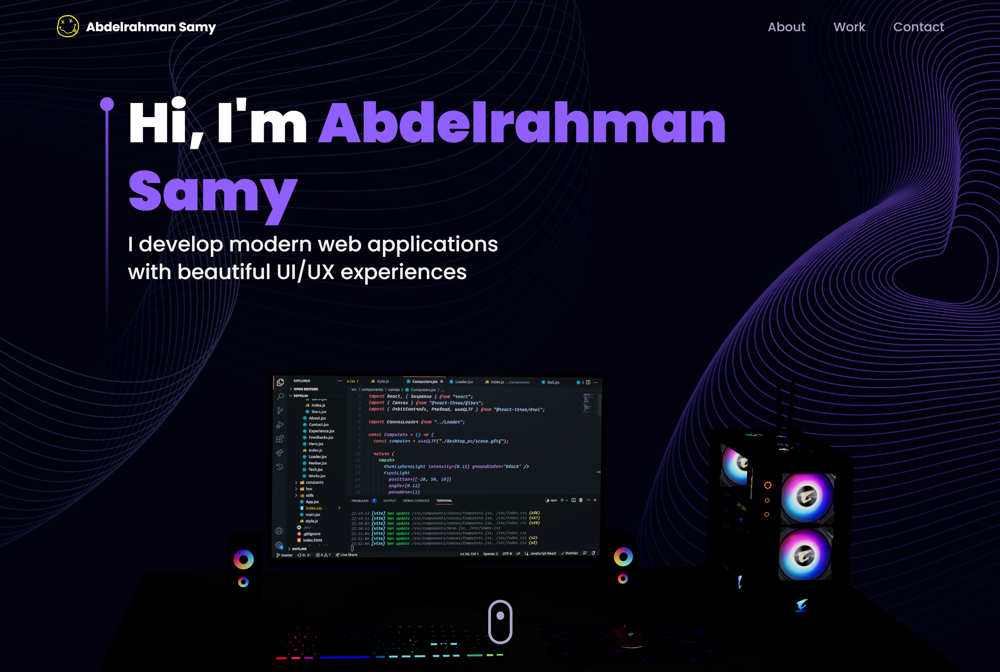

# 3D Portfolio | Abdelrahman Samy

<!-- GitHub badges -->

[](https://github.com/abdelrahman-samy-dev/abdelrahman-samy-dev.git)
[](LICENSE)
[](https://www.typescriptlang.org/)
[](https://reactjs.org/)
[](https://threejs.org/)
[](https://tailwindcss.com/)



[](https://github.com/abdelrahman-samy-dev)

## 🌐 Live Demo

Explore the live demonstration of my portfolio project:
[Abdelrahman Samy Portfolio](https://abdelrahman-samy-portfolio.vercel.app/)

## 📝 Description

Welcome to my **3D Portfolio** - a modern, interactive, and visually stunning showcase of my work and skills as a frontend developer. This portfolio is built with React.js and Three.js, featuring immersive 3D elements, smooth animations, and a fully responsive design that works flawlessly across all devices.

I've created this portfolio to demonstrate my technical skills, creativity, and attention to detail in web development. The project showcases my expertise in modern frontend technologies and my ability to create engaging user experiences.

<details><summary><b>Folder Structure</b></summary>

```bash
reactjs18-3d-portfolio/
├── src/
├   ├── App.tsx
├   ├── globals.css
├   ├── main.tsx
├   ├── vite.env.d.ts
├   ├── components/
├   ├   ├── atoms/
├   ├   ├   └── Header.tsx
├   ├   ├── canvas/
├   ├   ├   ├── Ball.tsx
├   ├   ├   ├── Computers.tsx
├   ├   ├   ├── Earth.tsx
├   ├   ├   ├── Stars.tsx
├   ├   ├   └── index.ts
├   ├   ├── layout/
├   ├   ├   ├── Loader.tsx
├   ├   ├   └── Navbar.tsx
├   ├   ├── sections/
├   ├   ├   ├── About.tsx
├   ├   ├   ├── Contact.tsx
├   ├   ├   ├── Experience.tsx
├   ├   ├   ├── Feedbacks.tsx
├   ├   ├   ├── Hero.tsx
├   ├   ├   ├── Tech.tsx
├   ├   ├   ├── Works.tsx
├   ├   ├   └── page.tsx
├   ├   └── index.ts
├   ├── constants/
├   ├   ├── config.ts
├   ├   ├── styles.ts
├   ├   └── index.ts
├   ├── hoc/
├   ├   ├── SectionWrapper.tsx
├   ├   └── index.ts
├   ├── utils/
├   ├   └── motion.ts
├   ├── types/
├   ├   └── index.d.ts
├   └── assets/
├       ├── company/
├       ├   └── [[...]].{svg,png}
├       ├── tech/
├       ├   └── [[...]].{svg,png}
├       ├── [[...]].{svg,png}
├       └── index.ts
├── public/
├   ├── desktop_pc
├   ├   ├── textures/[[...]].png
├   ├   ├── license.txt
├   ├   ├── scene.bin
├   ├   └── scene.gltf
├   ├── planet
├   ├   ├── textures/[[...]].png
├   ├   ├── license.txt
├   ├   ├── scene.bin
├   ├   └── scene.gltf
├   ├── logo.png
├   └── logo.svg
├── .env
├── .eslintignore
├── .eslintrc.cjs
├── .gitignore
├── .prettierignore
├── .prettierrc.cjs
├── index.html
├── LICENSE
├── README.md
├── package.json
├── postcss.config.cjs
├── tailwind.config.cjs
├── tsconfig.json
├── tsconfig.node.json
└── vite.config.js
```

</details>

## 📖 Table of Contents

<details><summary>Table of Contents</summary>

- [Live Demo](#-live-demo)
- [Description](#-description)
- [Technologies Used](#-technologies-used)
- [Get Started](#-get-started)
  - [Prerequisites](#-prerequisites)
  - [Installation and Run Locally](#-installation-and-run-locally)
  - [Scripts](#-scripts)
- [Environment Variables](#-environment-variables)
- [Deployment](#-deployment)
  - [Deploy to production (manual)](#-deploy-to-production-manual)
  - [Deploy on Vercel (recommended)](#-deploy-on-vercel-recommended)
  - [Deploy on Netlify](#-deploy-on-netlify)
- [Contributing](#-contributing)
  - [Bug / Feature Request](#-bug--feature-request)
- [Acknowledgements](#-acknowledgements)
- [References](#-references)
- [Contact Us](#-contact-us)
- [License](#-license)

</details>

## ✨ Technologies Used

<details><summary><b>My 3D Portfolio</b> is built using the following modern technologies:</summary>

- **Frontend Framework**:
  - [React.js](https://reactjs.org/): A powerful JavaScript library for building interactive user interfaces with component-based architecture
  - [TypeScript](https://www.typescriptlang.org/): Adding type safety to enhance code quality and developer experience

- **3D Visualization**:
  - [Three.js](https://threejs.org/): Creating stunning 3D graphics and animations in the browser
  - [@react-three/fiber](https://github.com/pmndrs/react-three-fiber): React renderer for Three.js
  - [@react-three/drei](https://github.com/pmndrs/drei): Useful helpers for React Three Fiber

- **Styling & Animation**:
  - [Tailwind CSS](https://tailwindcss.com/): Utility-first CSS framework for rapid UI development
  - [Framer Motion](https://www.framer.com/motion/): Production-ready animation library for React
  - [React Parallax Tilt](https://www.npmjs.com/package/react-parallax-tilt): Creating tilt hover effects
  - [React Vertical Timeline](https://www.npmjs.com/package/react-vertical-timeline-component): For the experience timeline section

- **Build Tools & Development**:
  - [Vite](https://vitejs.dev/): Next-generation frontend tooling for faster development
  - [ESLint](https://eslint.org/): Code quality and consistency
  - [Prettier](https://prettier.io/): Code formatting

- **Contact Functionality**:
  - [EmailJS](https://www.emailjs.com/): Client-side email sending capability

- **Deployment**:
  - [Vercel](https://vercel.com/): Fast and reliable hosting platform

</details><br/>

[](https://skillicons.dev)

## ✨ Key Features

- **Interactive 3D Elements**: Engaging 3D models and animations created with Three.js
- **Responsive Design**: Perfectly adapts to all screen sizes from mobile to desktop
- **Modern UI/UX**: Clean, intuitive interface with smooth animations and transitions
- **Performance Optimized**: Fast loading times and smooth interactions
- **Dynamic Content**: Easily updatable projects, skills, and experience sections
- **Contact Form**: Functional contact form with EmailJS integration
- **Custom 3D Models**: Unique 3D elements that represent my skills and personality
- **Accessibility Focused**: Designed with web accessibility best practices
- **SEO Friendly**: Optimized for search engines

## 🧰 Get Started

To get this project up and running in your development environment, follow these step-by-step
instructions.

### 📋 Prerequisites

In order to install and run this project locally, you would need to have the following installed on
your local machine.

- [Node.js](https://nodejs.org/en/)
- [NPM](https://www.npmjs.com/get-npm)
- [Git](https://git-scm.com/downloads)

### ⚙️ Installation and Run Locally

**Step 0:**

Note :bangbang: The application uses EmailJS for the contact form functionality. To enable this feature:
1. Create an EmailJS account [here](https://emailjs.com/)
2. Set up the following environment variables in a `.env` file:
   - `VITE_EMAILJS_SERVICE_ID`
   - `VITE_EMAILJS_TEMPLATE_ID`
   - `VITE_EMAIL_JS_ACCESS_TOKEN`

**Step 1:**

Clone my repository using the following command:

```bash
git clone https://github.com/abdelrahman-samy-dev/abdelrahman-samy-dev.git
```

**Step 2:**

Navigate to the project directory and install all dependencies:

```bash
cd abdelrahman-samy-dev
npm install
```

**Step 3:**

Start the development server:

```bash
npm run dev
```

**Step 4:**

Open [http://localhost:5173](http://localhost:5173) in your browser to see the portfolio in action.

### 📜 Scripts

All scripts are defined in the `package.json` file. Here is a list of all scripts:

| Script             | Action                                      |
| :----------------- | :------------------------------------------ |
| `npm install`      | Installs dependencies                       |
| `npm run dev`      | Starts local dev server at `localhost:5137` |
| `npm run build`    | Build your production site to `./dist/`     |
| `npm run preview`  | Boot up a local static web server           |
| `npm run lint`     | Run ESLint                                  |
| `npm run ts:check` | Perform type-checking                       |

## 🔒 Environment Variables

Environment variables[^3] can be used for configuration. They must be set before running the app.

> [Environment variables](https://en.wikipedia.org/wiki/Environment_variable) are variables that are
> set in the operating system or shell, typically used to configure programs.

**React.js 18 3D Portfolio** uses [EmailJS](https://www.emailjs.com/) as external service. You need
to create an account and get the required credentials to run the app.

Create a `.env` file in the root directory of the project and add the following environment
variables:

```env
VITE_EMAILJS_SERVICE_ID=<VITE_EMAILJS_SERVICE_ID>
VITE_EMAILJS_TEMPLATE_ID=<VITE_EMAILJS_TEMPLATE_ID>
VITE_EMAIL_JS_ACCESS_TOKEN=<VITE_EMAIL_JS_ACCESS_TOKEN>
```

## 🚀 Deployment

#### Deploy to production (manual)

You can create an optimized production build with the following command:

```bash
npm run build
```

#### Deploy on Vercel (recommended)

I recommend deploying this React application using the [Vercel Platform](https://vercel.com/) for the best performance and developer experience.

[](https://vercel.com/new/clone?repository-url=https%3A%2F%2Fgithub.com%2Fabdelrahman-samy-dev%2Fabdelrahman-samy-dev)

#### Deploy on Netlify

Alternatively, you can deploy this application with [Netlify](https://www.netlify.com/).

[](https://app.netlify.com/start/deploy?repository=https://github.com/abdelrahman-samy-dev/abdelrahman-samy-dev)

For more deployment options, check out the [Vite deployment documentation](https://vitejs.dev/guide/static-deploy.html).

## 🔧 Contributing

I welcome contributions to enhance this portfolio project! If you'd like to contribute, please follow these steps:

1. Fork the repository
2. Create a new branch for your feature (`git checkout -b feature/amazing-feature`)
3. Make your changes
4. Commit your changes (`git commit -m 'Add some amazing feature'`)
5. Push to the branch (`git push origin feature/amazing-feature`)
6. Open a Pull Request

### 📩 Bug Reports & Feature Requests

If you encounter any bugs or have ideas for new features, please open an issue [here](https://github.com/abdelrahman-samy-dev/abdelrahman-samy-dev/issues/new).

When reporting bugs, please include:
- A clear description of the issue
- Steps to reproduce the problem
- Expected vs. actual behavior
- Screenshots if applicable

For feature requests, please describe the proposed functionality in detail and explain how it would enhance the portfolio.

## 💎 Acknowledgements

I'd like to express my gratitude to the following technologies and resources that helped me build this portfolio:

- [React.js](https://reactjs.org/) and [TypeScript](https://www.typescriptlang.org/) for the frontend framework
- [Three.js](https://threejs.org/) and [React Three Fiber](https://github.com/pmndrs/react-three-fiber) for 3D graphics
- [Tailwind CSS](https://tailwindcss.com/) for styling
- [Framer Motion](https://www.framer.com/motion/) for animations
- [React Vertical Timeline Component](https://www.npmjs.com/package/react-vertical-timeline-component) for the experience section
- [React Parallax Tilt](https://www.npmjs.com/package/react-parallax-tilt) for interactive card effects
- [EmailJS](https://www.emailjs.com/) for the contact form functionality
- [Vite](https://vitejs.dev/) for the build system
- [Vercel](https://vercel.com/) for hosting

## 📞 Contact Me

Feel free to reach out to me through any of the following channels:

[](mailto:abdelrahman.samy.dev@gmail.com)
[](https://www.linkedin.com/in/abdelrahman-samy-ali/)
[](https://github.com/abdelrahman-samy-dev)

## 📋 License

This **3D Portfolio** project is open source software [licensed as MIT](https://opensource.org/license/mit/) and is free to use — See [LICENSE](LICENSE) for more details.
